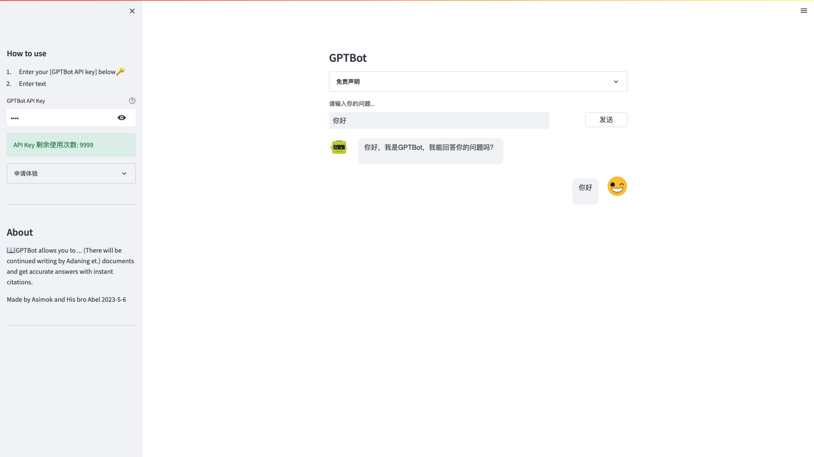
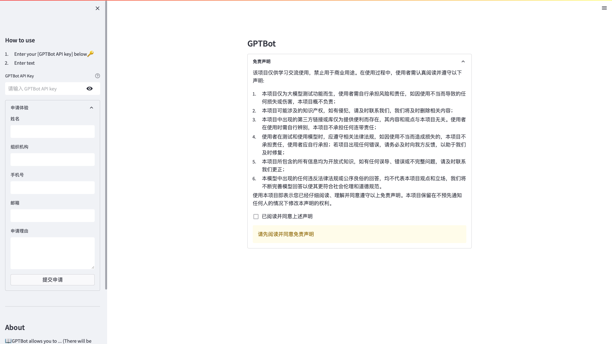

<div align="center">
<h1>AuthAPIConvBot</h1>
<p><em>提供API申请鉴权的对话式大模型接入平台</em></p>
<p>欢迎各位 star fork pr </p>
</div>

## 主要特色

- [x] 轻量简洁：streamlit+Flask+Sqlite3
- [x] 快速接入：只需配置AI模型API即可实现在线对话
- [x] API权限管理：提供模型API申请,鉴权,计费等功能
- [x] 一键部署：docker一键部署
- [x] 自由拓展：可以灵活拓展模型调用API，以及API权限管理

## 预览

### 首页

<table style="width: 100%">
<tr style="width: 100%;">
<td colspan="2" style="width: 100%;">

</td>
</tr>
</table>

### 申请授权码

<table style="width: 100%">
<tr style="width: 100%;">
<td colspan="2" style="width: 100%;">

</td>
</tr>
</table>

## 部署方式

### Docker部署示例

#### 1. 构建镜像

```sh
docker build . -t gptbot:latest
```

#### 2. 运行服务

```sh
docker run -d -p 8051:8051 --restart always --name gptbot  gptbot:latest
```

## 赞赏
> 如果能够帮助到你
<table style="width: 100%">
<tr style="width: 100%;">
<td style="width: 30%;text-align: center;">
支付宝<br/>

</td>
<td style="width: 30%;text-align: center">
微信<br/>

</td>
</tr>
</table>    

## 免责声明

本项目开源仅供学习使用，不得用于任何违法用途，否则后果自负，与本人无关。使用请保留项目地址谢谢。